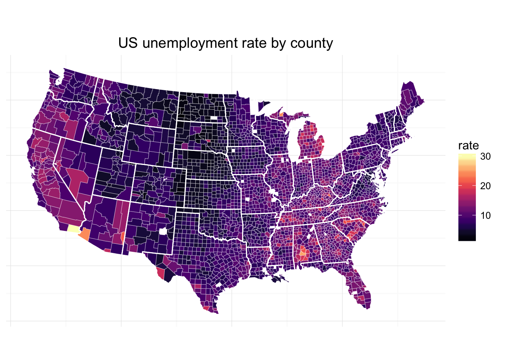

# BIO 770 – Data Wrangling and Visualization Using R – Fall 2016 #
\setlength{\LTleft}{0pt}

{ width=50% }\	

# Course information #

|                    |                                                               |
|--------------------+---------------------------------------------------------------|
| **Instructor**     | Dr. Jeremy Van Cleve                                          |
| **E-mail**         | <jvancleve@uky.edu>                                           |
| **Phone**          | (859) 218-3020                                                |
| **Office**         | 105A MDR3                                                     |
| **Office hours**   | By appointment                                                |
|                    |                                                               |
| **Class Time**     | W 12 – 1 PM                                                   |
| **Class Location** | ASB 231                                                       |
| **Website**        | <https://github.com/vancleve/BIO770-DWVR> (github website)    |
|                    | <https://uk.instructure.com/courses/1843807> (Canvas website) |

# Course description #

The last 15 years have seen the
[R programming language](https://www.r-project.org/) rise in
popularity from a language used and developed primarily by
statisticians to one used and developed by anyone interested in
analyzing and visualizing data from scientists and engineers to
historians and journalists. This **one-credit** seminar aims to
provide a brief introduction (i.e., a *crash course*) to using R for
analyzing and visualizing data. As R and other scripting languages
become more popular, so do tools the tools required to document,
maintain, share, and replicate analyses and visualization. These
activities constitute the notions of "literate programming" and
"reproducible research", and we will use some of these tools, which
include [`markdown`](https://daringfireball.net/projects/markdown/),
[`git`](https://git-scm.com/), and others.

Prerequisites: None.

# Student learning outcomes #

1. Execute commands in R
2. Create [R Markdown](http://rmarkdown.rstudio.com/) documents that
   explain and reproduce analyses
3. Wrangle and manipulate data by slicing matrices and by using the
   `dplyr` and `tidyr` packages
4. Plotting using the [`ggplot2`](http://ggplot2.org/) package
5. Visualize multidimensional data using 2D/3D plots, networks,
   and other tools
6. Create easily reproducible publication quality figures without
   expensive applications

# Course format #

Each week will consist of a short introduction and interactive demonstration of the concepts and tools for that week followed a short lab where students apply the concepts and tools. There may be preliminary readings to do before class for some weeks (see "Topic schedule" below); please make sure to do those so that we make the most of time in class.

# Assessment #

|                |     |                                           |
|----------------+-----+-------------------------------------------|
| Attendance     | 20% | One absence permitted without penalty     |
| Lab work       | 40% | Submitted as R Markdown before next class |
|                |     | One missing lab permitted without penalty |
| Lightning talk | 40% | 4 min presentation and source for figures |
|                |     | Due by end of last day of class (12/7)    |

The assessment portion of the course has three components. 

1. Class attendance. 
2. Completion of the lab component that we begin in class. This must be turned in as an R Markdown document. If there are datasets that are required for the analysis (other than datasets provided as part of the lab), these should be provided along with the R Markdown file by adding all the files to a single compressed `zip` file. The `Rmd` or `zip` file should then be uploaded to the Canvas course website: <https://uk.instructure.com/courses/1843807>.
3. Lightning talk final presentation. The last two classes will be devoted to short four minute presentations of **three** figures that present data from a single dataset of your choice. The figures should be "publication quality" in terms of aesthetics (labeling, font size, colors, etc) but do not need a caption (that's what the talk is for!). The R Markdown source code and any necessary data files must be submitted to the Canvas website as a `zip` file; compiling the R Markdown file should produce the figures as they were presented during the lightning talk. If you want a challenge, you can even write your slides in R Markdown too!

# Getting help (i.e., uh, how do I...?) #

## Classmates and instructor

1. Start a discussion on the [Canvas website](https://uk.instructure.com/courses/1843807). This will allow everyone to benefit from the questions and answers posed. I will monitor this discussion and post replies as necessary. Please also post your own replies too!
2. Instructor office hours.

## Internet

1. Stack Overflow (<http://stackoverflow.com/>). Programming and developer Q&A site. Search as normal for keywords, add tags enclosed in square brackets, e.g. [ggplot] or [git], to restrict results to the library or language you want answers in.
2. Cross Validated (<http://stats.stackexchange.com/>). A site in the same family as Stack Overflow. Focused on conceptual and procedural questions in statistics (less on implementation in R or other languages).
3. Google. The oldie but the goodie.

# Useful resources #

## Books ##

The following are some popular books on R. PDFs are available for "check out" on the [Canvas website](https://uk.instructure.com/courses/1843807/modules) under "Modules: References".

- Crawley, Michael J.. 2005. Statistics: An Introduction using R. Wiley
- Dalgaard, Peter. 2008. Introductory Statistics with R. Springer
- Murrell, Paul. 2011. R Graphics. CRC Press
- Chang, Winston. 2013. R Graphics Cookbook. O’Reilly
- Gandrud, Christopher. 2015. Reproducible Research with R and R Studio. CRC Press. 
- Zelterman, Daniel. 2015. Applied Multivariate Statistics with R. Springer
- Phillips, Nathaniel. 2016. YaRrr! The Pirate’s Guide to R. <http://nathanieldphillips.com/thepiratesguidetor/>
- Wickham, Hadley. 2016. ggplot2. Springer
- Wickham, Hadley and Grolemund, Garrett. 2016. R for Data Science. O'Reilly. <http://r4ds.had.co.nz/> (no PDF but full book on website)

## Internet ##

- RStudio Cheatsheets (<https://www.rstudio.com/resources/cheatsheets/>). Cheatsheets for working with `ggplot2`, R Markdown, and other R packages.
- Try R (<http://tryr.codeschool.com/>). An interactive online R tutorial.
- FlowingData (<http://flowingdata.com/>). Articles, examples, and tutorials on data visualization by Nathan Yau.
- Other data visualization and wrangling courses:
    - "Data Visualization" by Kieran Healy (Duke): <http://vissoc.co/>
    - "Visualizing Data" by Chris Adolph (UWashington): <http://faculty.washington.edu/cadolph/index.php?page=22>
    - "Data wrangling, exploration, and analysis with R" by Jenny Bryan (UBC): <http://stat545.com/>
